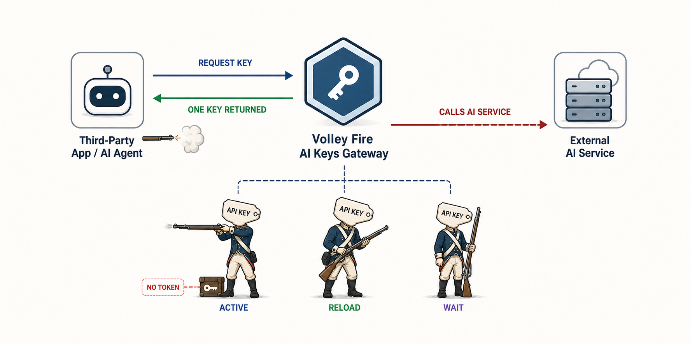

# Volley Fire AI Keys

An API key rotation gateway for AI agents and services.

[Live service](https://volley-fire.ai-keys.workers.dev) ·
[Create an account](https://volley-fire.ai-keys.workers.dev/signup)



Volley Fire AI Keys gives agents one stable AI Connection token. When an
external app or AI agent asks for a provider key, the Worker returns one
least-recently-requested key for that platform and updates its request
timestamp. The gateway does not call providers; it only hands out the next key
for the caller to use.

## How It Works

Add several free or low-quota provider API keys to the dashboard under the same
platform. Your third-party app or AI agent keeps one AI Connection token for
Volley Fire AI Keys, asks the gateway for a provider key, then uses that key
with the real AI service.

When that provider key is blocked, exhausted, or no longer useful, the app asks
Volley Fire AI Keys again. The gateway returns the next least-recently-requested
key, and the app repeats the same provider call with a fresh key.

## Rotation Rule

- Return one provider key per rotate request.
- Rotate keys by `last_requested_at`.
- Treat `NULL last_requested_at` as the oldest state.
- Keep v1 state simple: no cooldowns, cycles, disabled flags, or soft revokes.
- Delete provider keys and AI Connection tokens when removing them.

## Agent API

Add a provider key:

```http
POST /api/keys/openai
Authorization: Bearer vf_live_xxxxx
Content-Type: application/json
```

```json
{
  "apiKey": "sk-fake-example",
  "label": "optional-label"
}
```

The response confirms creation without returning the stored provider key.

Rotate and retrieve the next provider key:

```http
GET /api/rotate/openai
Authorization: Bearer vf_live_xxxxx
```

```json
{
  "platform": "openai",
  "apiKey": "sk-fake-example",
  "requestedAt": "2026-05-05T00:00:00.000Z"
}
```

Use platform names such as `openai`, `anthropic`, `google`, `openrouter`,
`xai`, `deepseek`, `groq`, `mistral`, `perplexity`, or `cohere`.

## Dashboard

The dashboard is for:

- adding encrypted provider keys
- deleting provider keys
- copying the user's AI Connection prompt
- reissuing the single active AI Connection token

Reissuing an AI Connection token replaces the previous token. Existing AI
integrations may stop working until they use the new prompt.

## Local Setup

Install dependencies:

```sh
npm install
```

Create local secrets:

```sh
cp .dev.vars.example .dev.vars
```

Set real local values for:

- `ENCRYPTION_KEY_B64`
- `SESSION_SECRET`
- `TOKEN_PEPPER`

Run D1 migrations locally:

```sh
npm run db:migrate:local
```

Start the Worker:

```sh
npm run dev
```

## Deploy

Apply remote migrations:

```sh
npm run db:migrate:remote
```

Deploy to Cloudflare Workers:

```sh
npm run deploy
```

Production secrets should be stored as Workers secrets, not committed files.

## Security

- Never commit real provider API keys, Cloudflare API tokens, access tokens, or
  session secrets.
- Encrypt provider API keys before storage.
- Hash AI Connection tokens for lookup and encrypt their display copy.
- Never log decrypted provider API keys.
- Return secret-bearing responses with `Cache-Control: no-store`.
- Keep examples fake and obviously non-production.
